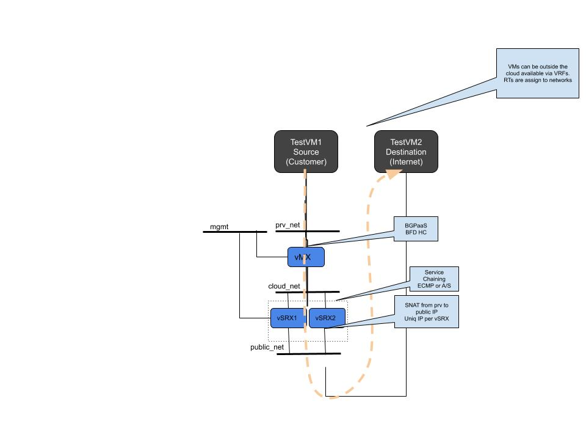

# nfv-test
Heat templates for testing NFV use-cases using vMX and vSRX
---

# Topology


1. Download vMX image from http://juniper.net version *18.4R2.7*

2. Unpack images (vCP nad vFP)

 ```
 tar xvf vmx-bundle-18.4R2.7.tgz 
  cd vmx/images/
 ```


3. Upload Control and Data plane images into glance

```
openstack image create --file vFPC-20190611.img --property hw_vif_model=virtio --property hw_disk_bus=ide --property hw_cdrom_bus=ide --disk-format qcow2 --container-format bare --public vmx-vfp-huge
openstack image create --file junos-vmx-x86-8.4R2.7.qcow2 --property hw_vif_model=virtio --property hw_disk_bus=ide --property hw_cdrom_bus=ide --disk-format qcow2 --container-format bare --public vmx-vcp-huge
```


4. Create flavors for vMX on DPDK


```
openstack flavor create --ram 4096 --disk 35 --vcpus 2 vmx-vcp-huge
openstack flavor create --ram 16384 --disk 10 --vcpus 10 vmx-vfp-huge
openstack flavor set vmx-vcp-huge --property hw:mem_page_size=large
openstack flavor set vmx-vfp-huge --property hw:mem_page_size=large
openstack flavor set --property hw:cpu_policy='dedicated' vmx-vcp-huge
openstack flavor set --property hw:cpu_policy='dedicated' vmx-vfp-huge

```


5. Create flavors for vMX on Kernel


```
openstack flavor create --ram 4096 --disk 35 --vcpus 2 vmx-vcp-kernel
openstack flavor create --ram 16384 --disk 10 --vcpus 10 vmx-vfp-kernel
```

6. Download vSRX image from juniper.net version 18.4R1-S3.1

```
openstack image create --file junos-vsrx3-x86-64-18.4R1-S3.1.qcow2 --property hw_vif_model=virtio --property hw_disk_bus=ide --property hw_cdrom_bus=ide --disk-format qcow2 --container-format bare --public vsrx3.0
```

7. Create flavor for vSRX

```
openstack flavor create --ram 16384 --disk 200 --vcpus 10 vsrx-huge
openstack flavor set vsrx-huge --property hw:mem_page_size=large
openstack flavor set --property hw:cpu_policy='dedicated' vsrx-huge
```

8. Download heats and run stack deployment

```
git clone https://github.com/PrzemekGrygiel/nfv-test.git
cd nfv-test
openstack stack create -t vnf-test.yml -e vnf-test.env VNF-test 
```
